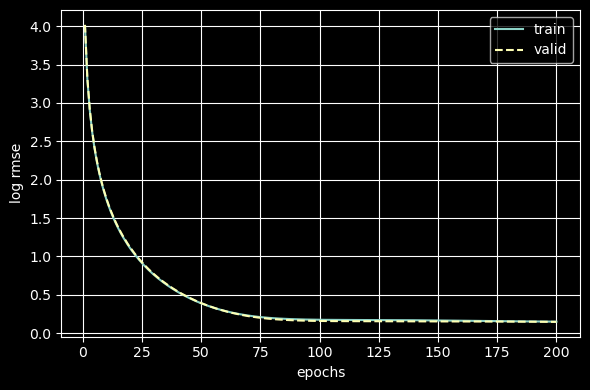
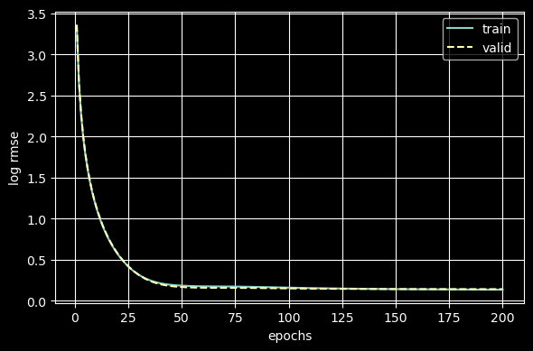
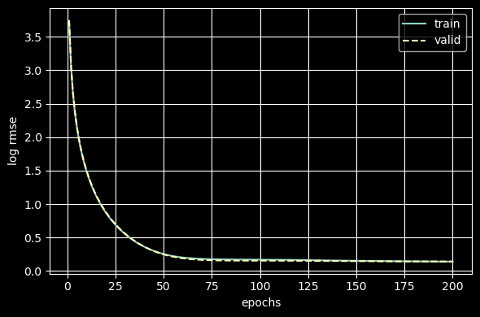
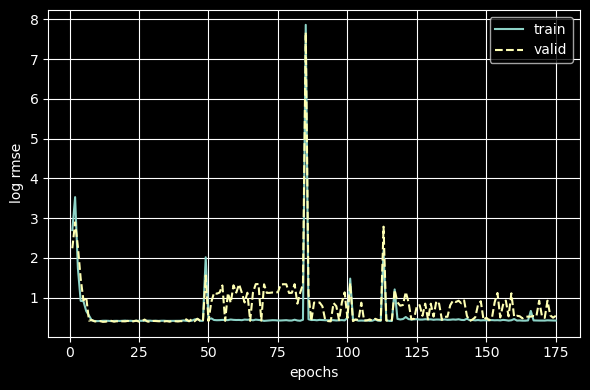
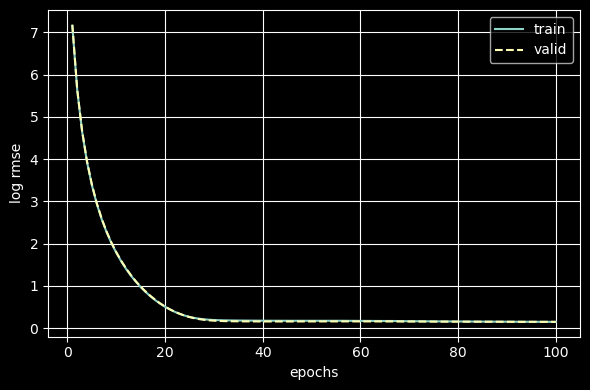
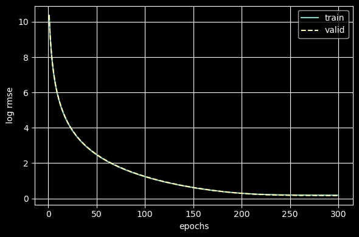
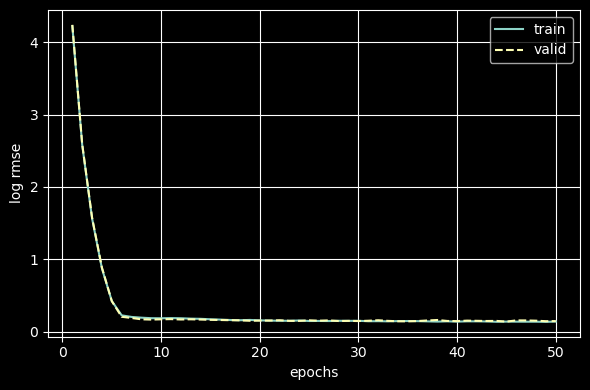

# 基于K折交叉验证的超参数调整记录
# 网络深度、超参数对于预测质量的影响
- 网络深度（Network Depth）：模型的抽象能力。层数越多，越能捕捉非线性特征。过浅容易欠拟合，无法提取深层规律；过深容易过拟合，模型会死板地记住某些特征。
- 学习率（Learning Rates）：模型参数更新的步长。学习率过大，会导致损失函数震荡甚至不收敛；太小容易导致收敛慢，陷入局部最优解。
- 训练次数（Epochs）：学习的时间长短。过多，会导致训练损失下降但验证损失开始上升，即过拟合。
- 权重衰减（Weight Decay）：强迫权重保持在一个较小的值。过小，模型复杂，容易过拟合；过大，模型简单，牺牲训练精度但能提高泛化能力。
- 批量大小（Batch Size）：每次迭代计算梯度时使用的样本数量。小批量梯度计算包含更多噪声，有天然的正则化效果，有助于跳出局部最优解，但训练速度慢；大批量梯度更准，训练快且稳定，但容易导致模型收敛在局部最优解，泛化性略差（常用32，64，128）。
- 暂退法（Dropout）：训练时随机让一些神经元失效，防止模型过度依赖某些特征。强迫网络在不完整条件下学习更稳健的特征，降低验证集RMSE（0.2~0.5），丢弃率越高正则化效果越强。

# 使用单层结构
## 对batch_size的调整
```python
k, num_epochs, lr, weight_decay, batch_size = 5, 200, 2, 0.001, 32
```

```
折1，训练log rmse0.149779, 验证log rmse0.146898
折2，训练log rmse0.145348, 验证log rmse0.162422
折3，训练log rmse0.143616, 验证log rmse0.150974
折4，训练log rmse0.149026, 验证log rmse0.144642
折5，训练log rmse0.143248, 验证log rmse0.173034
5-折验证：平均训练log rmse：0.146203, 平均验证log rmse0.155594
```

```python
k, num_epochs, lr, weight_decay, batch_size = 5, 200, 2, 0.001, 16
```

```
折1，训练log rmse0.134377, 验证log rmse0.141243
折2，训练log rmse0.131128, 验证log rmse0.147903
折3，训练log rmse0.129494, 验证log rmse0.146244
折4，训练log rmse0.135225, 验证log rmse0.133605
折5，训练log rmse0.127247, 验证log rmse0.163292
5-折验证：平均训练log rmse：0.131494, 平均验证log rmse0.146457
```

```python
k, num_epochs, lr, weight_decay, batch_size = 5, 200, 2, 0.001, 24
```
```

折1，训练log rmse0.141131, 验证log rmse0.142886
折2，训练log rmse0.137623, 验证log rmse0.152819
折3，训练log rmse0.135730, 验证log rmse0.146803
折4，训练log rmse0.141270, 验证log rmse0.138383
折5，训练log rmse0.134248, 验证log rmse0.167678
5-折验证：平均训练log rmse：0.138000, 平均验证log rmse0.149714
```

## 对lr的调整
```python
k, num_epochs, lr, weight_decay, batch_size = 5, 200, 1, 0.001, 24
```
```
折1，训练log rmse0.165547, 验证log rmse0.155048
折2，训练log rmse0.157911, 验证log rmse0.181742
折3，训练log rmse0.158266, 验证log rmse0.166007
折4，训练log rmse0.162811, 验证log rmse0.151312
折5，训练log rmse0.158942, 验证log rmse0.179633
5-折验证：平均训练log rmse：0.160695, 平均验证log rmse0.166748
```

```python
k, num_epochs, lr, weight_decay, batch_size = 5, 200, 1.2, 0.001, 24
```
```
折1，训练log rmse0.158686, 验证log rmse0.151304
折2，训练log rmse0.152249, 验证log rmse0.173879
折3，训练log rmse0.151499, 验证log rmse0.159429
折4，训练log rmse0.156440, 验证log rmse0.147793
折5，训练log rmse0.152337, 验证log rmse0.176347
5-折验证：平均训练log rmse：0.154242, 平均验证log rmse0.161750
```

```python
k, num_epochs, lr, weight_decay, batch_size = 5, 200, 1.4, 0.001, 24
```
```
折1，训练log rmse0.152552, 验证log rmse0.147761
折2，训练log rmse0.147239, 验证log rmse0.165808
折3，训练log rmse0.145631, 验证log rmse0.154222
折4，训练log rmse0.151055, 验证log rmse0.144661
折5，训练log rmse0.145743, 验证log rmse0.173236
5-折验证：平均训练log rmse：0.148444, 平均验证log rmse0.157138
```

## num_epochs的调整
```python
k, num_epochs, lr, weight_decay, batch_size = 5, 125, 1.2, 0.001, 24
```
```
折1，训练log rmse0.174730, 验证log rmse0.158315
折2，训练log rmse0.169059, 验证log rmse0.184193
折3，训练log rmse0.170417, 验证log rmse0.179226
折4，训练log rmse0.173075, 验证log rmse0.161572
折5，训练log rmse0.166580, 验证log rmse0.185621
5-折验证：平均训练log rmse：0.170772, 平均验证log rmse0.173785
```

```python
k, num_epochs, lr, weight_decay, batch_size = 5, 150, 1.2, 0.001, 24
```
```
折1，训练log rmse0.169839, 验证log rmse0.156127
折2，训练log rmse0.162477, 验证log rmse0.185152
折3，训练log rmse0.164067, 验证log rmse0.171671
折4，训练log rmse0.167736, 验证log rmse0.154974
折5，训练log rmse0.162753, 验证log rmse0.182168
5-折验证：平均训练log rmse：0.165374, 平均验证log rmse0.170018
```

```python
k, num_epochs, lr, weight_decay, batch_size = 5, 175, 1.2, 0.001, 24
```
```
折1，训练log rmse0.165185, 验证log rmse0.154627
折2，训练log rmse0.157405, 验证log rmse0.182684
折3，训练log rmse0.158077, 验证log rmse0.165481
折4，训练log rmse0.162692, 验证log rmse0.151205
折5，训练log rmse0.158953, 验证log rmse0.179576
5-折验证：平均训练log rmse：0.160462, 平均验证log rmse0.166715
```

# 使用MLP
```python
loss = nn.MSELoss()
in_features = train_features.shape[1]
def get_net():
    net = nn.Sequential(
        nn.Flatten(),
        nn.Linear(in_features, 256),
        nn.ReLU(),
        nn.Dropout(0.2),
        nn.Linear(256, 256),
        nn.Dropout(0.2),
        nn.Linear(256, 1))
    return net
k, num_epochs, lr, weight_decay, batch_size = 5, 175, 1.2, 0.001, 24
```

```
折1，训练log rmse0.420871, 验证log rmse0.540431
折2，训练log rmse0.417325, 验证log rmse0.830720
折3，训练log rmse0.468302, 验证log rmse0.791870
折4，训练log rmse0.419075, 验证log rmse0.412826
折5，训练log rmse0.414143, 验证log rmse0.901285
5-折验证：平均训练log rmse：0.427943, 平均验证log rmse0.695427
```

```python
loss = nn.MSELoss()
in_features = train_features.shape[1]
def get_net():
    net = nn.Sequential(
        nn.Flatten(),
        nn.Linear(in_features, 128),
        nn.ReLU(),
        #nn.Dropout(0.2),
        nn.Linear(128, 1),
        #nn.Dropout(0.2),
        #nn.Linear(256, 1)
    )
    return net
k, num_epochs, lr, weight_decay, batch_size = 5, 100, 0.1, 0.001, 64
```
```
折1，训练log rmse0.104540, 验证log rmse0.156216
折2，训练log rmse0.090403, 验证log rmse0.152324
折3，训练log rmse0.102531, 验证log rmse0.153212
折4，训练log rmse0.102817, 验证log rmse0.138419
折5，训练log rmse0.097196, 验证log rmse0.156971
5-折验证：平均训练log rmse：0.099498, 平均验证log rmse0.151429
```

```python
loss = nn.MSELoss()
in_features = train_features.shape[1]
def get_net():
    net = nn.Sequential(
        nn.Flatten(),
        nn.Linear(in_features, 128),
        nn.ReLU(),
        #nn.Dropout(0.2),
        nn.Linear(128, 1),
        #nn.Dropout(0.2),
        #nn.Linear(256, 1)
    )
    return net
k, num_epochs, lr, weight_decay, batch_size = 5, 100, 0.01, 0.005, 64
```

```
折1，训练log rmse0.148179, 验证log rmse0.147960
折2，训练log rmse0.145645, 验证log rmse0.161989
折3，训练log rmse0.144027, 验证log rmse0.149571
折4，训练log rmse0.147352, 验证log rmse0.146359
折5，训练log rmse0.141721, 验证log rmse0.174307
5-折验证：平均训练log rmse：0.145385, 平均验证log rmse0.156037
```

```python
loss = nn.MSELoss()
in_features = train_features.shape[1]
def get_net():
    net = nn.Sequential(
        nn.Flatten(),
        nn.Linear(in_features, 256),
        nn.ReLU(),
        nn.Dropout(0.2),
        nn.Linear(256, 1)
    )
    return net
```

```
折1，训练log rmse0.182904, 验证log rmse0.162616
折2，训练log rmse0.181431, 验证log rmse0.192856
折3，训练log rmse0.178016, 验证log rmse0.184712
折4，训练log rmse0.179892, 验证log rmse0.170536
折5，训练log rmse0.173980, 验证log rmse0.189204
lr=0.001, weight_decay=0.01, batch_size=64
5-折验证：平均训练log rmse：0.179245, 平均验证log rmse0.179985
```


```python
loss = nn.MSELoss()
in_features = train_features.shape[1]
def get_net():
    net = nn.Sequential(
        nn.Flatten(),
        nn.Linear(in_features, 128),
        nn.ReLU(),
        nn.Dropout(0.2),
        nn.Linear(128, 1)
    )
    return net
```

```
折1，训练log rmse0.140771, 验证log rmse0.146788
折2，训练log rmse0.134192, 验证log rmse0.158296
折3，训练log rmse0.136199, 验证log rmse0.162753
折4，训练log rmse0.137091, 验证log rmse0.142295
折5，训练log rmse0.130478, 验证log rmse0.172908
lr=0.05, weight_decay=0.05, batch_size=64
5-折验证：平均训练log rmse：0.135746, 平均验证log rmse0.156608
```
**最终提交成绩：**<font color=red>0.1435</font>
